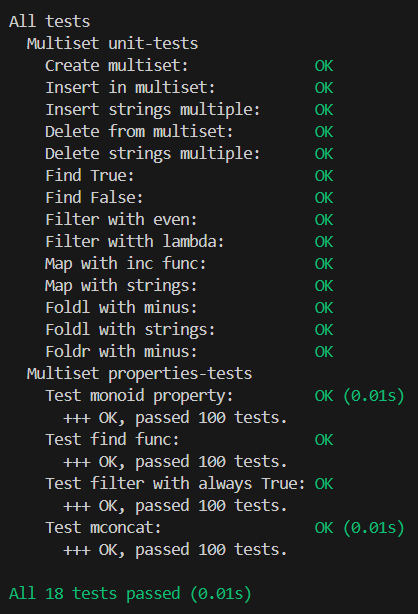

# Лабараторная работа №2

Шикунов Максим Евгеньевич P3333  
Интерфейс: Separate Chaining Hashmap
Структура данных: Multiset

## Требования к разработанному ПО

1. Функции:
    - добавление и удаление элементов
    - фильтрация
    - отобрадение (map)
    - свертски (левая и правая)
    - структура должна быть моноидом
2. Структура данных должна быть неизменяемой
3. Библиотека должна быть протестирована в рамках unit-testing
4. Библиотека должна быть протестирована в рамках property-based тестирования (как минимум 3 свойства, включая свойства моноида)
5. Структура данных должна быть полиморфной
6. Требуется использовать идиоматичный для технологии стиль программирования

## Реализация структуры данных

Интерфейс Separate Chaining Hashmap реализован в [SCHashmap](src/SCHashMap.hs)  

### Типы

```Haskell
type Key = Int
type Count = Int

newtype Value a = Value a deriving (Eq, Ord)
newtype Bucket a = Bucket [(Value a, Count)] deriving (Eq)
newtype SCHashMap a = SCHashMap [(Key, Bucket a)]
```

Тип SCHashMap полиморфный

### Основные функции

```Haskell
# Добавление элемента в hashmap
insert :: (Hashable a) => Value a -> SCHashMap a -> SCHashMap a
insert value (SCHashMap hashMap) = SCHashMap newHashMap
  where
    key = hashFunc value

    (Bucket bucket) = snd (hashMap !! key)

    toUpdateValue = filter (\pair -> fst pair == value) bucket

    newBucket =
      if length toUpdateValue == 1
        then filter (\pair -> fst pair /= value) bucket ++ [(value, snd (head toUpdateValue) + 1)]
        else bucket ++ [(value, 1)]

    newHashMap = take key hashMap ++ [(key, Bucket newBucket)] ++ drop (key + 1) hashMap

# Удаление элемента из hashmap
delete :: (Hashable a) => SCHashMap a -> Value a -> SCHashMap a
delete (SCHashMap hashMap) value = SCHashMap newHashMap
  where
    key = hashFunc value

    (Bucket bucket) = snd (hashMap !! key)

    toUpdateValue = filter (\pair -> fst pair == value) bucket

    newBucket
      | null toUpdateValue = error "Error: value doesn't exist"
      | snd (head toUpdateValue) == 1 = filter (\pair -> fst pair /= value) bucket
      | otherwise = filter (\pair -> fst pair /= value) bucket ++ [(value, snd (head toUpdateValue) - 1)]

    newHashMap = take key hashMap ++ [(key, Bucket newBucket)] ++ drop (key + 1) hashMap

# Поиск элемента в hashmap
find :: (Hashable a) => SCHashMap a -> Value a -> Bool
find (SCHashMap hashMap) value = not (null findValue)
  where
    key = hashFunc value
    (Bucket bucket) = snd (hashMap !! key)

    findValue = filter (\pair -> fst pair == value) bucket

# Фильтрация hashmap
filterHashMap :: (a -> Bool) -> SCHashMap a -> SCHashMap a
filterHashMap func (SCHashMap hashMap) = SCHashMap newHashMap
  where
    newHashMap = [(key, Bucket filteredBucket) | (key, Bucket bucket) <- hashMap, let filteredBucket = filter (\(Value v, _) -> func v) bucket]

# Отобрадение hashmap
mapHashMap :: (a -> b) -> SCHashMap a -> SCHashMap b
mapHashMap func (SCHashMap hashMap) = SCHashMap newHashMap
  where
    newHashMap = [(key, Bucket mapedBucket) | (key, Bucket bucket) <- hashMap, let mapedBucket = map (\(Value v, count) -> (Value (func v), count)) bucket]

# Левая сверстка hashmap
foldlHashMap :: (b -> a -> b) -> b -> SCHashMap a -> b
foldlHashMap func acc (SCHashMap hashMap) = foldl bucketFold acc hashMap
  where
    bucketFold acc' (_, Bucket bucket) = foldl valueFold acc' bucket
    valueFold acc'' (Value v, count) = iterate (`func` v) acc'' !! count

# Правя свертска hashmap
foldrHashMap :: (a -> b -> b) -> b -> SCHashMap a -> b
foldrHashMap func acc (SCHashMap hashmap) = foldr bucketFold acc hashmap
  where
    bucketFold (_, Bucket bucket) acc' = foldr valueFold acc' bucket
    valueFold (Value v, count) acc'' = foldr (\_ acc''' -> func v acc''') acc'' [1 .. count]
```

## Тестирование

Данная структура данных протестирована с помощью [unit тестов](test/TestMultiset.hs) и [property-based тестов](test/PropertyTestMultiset.hs).

### Отчет по тестированию


